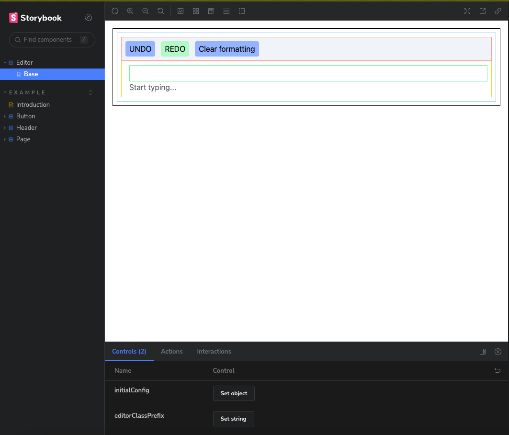

# Getting Things Started

So I'm kind of documenting the development of this library/starter-kit
for lexi-flow (or whatever name it will have in the future).

Lexical is a text editing framework built to be used in the browser.
The team behind lexical is **Meta**.

It was originally created to solve some of the most difficult problems in creating efficient
and extensible text editors on the web.

The biggest problem is the contenteditable api which does not provide a standard approach
for input events and selection events. This makes it very difficult to create a consistent
environment for text editing.

Another problem is with the IME (input method event) api which is not supported by all browsers
and has some weird quirks to it's behavior, this is mainly used in asian languages that make
use of Text Composition api (to compose asian characters from multiple key strokes like in Korean).

I actually had a similar problem a couple months ago, I was working on a project library
that used prosemirror, it was also a text editing library.

The issue was that a customer from South Korea was having issues with the editor
breaking lines or chopping off characters when using the IME.
I've scattered the internet for a solution but I couldn't find any, lot's of places
mentioned these IME problems but I haven't even heard of that before.

Anyway, if Lexical really does help fixing these problems I'm really exited to see
what it can do for the web. That's why I started this library, to provide a simple
starting point with great developer experience so everyone can take advantage of meta's new library
which I think it's great and uses a very different approach for building text editors
that scale both in the number of features and stability.

Below is a screenshot of the current state of the library, it's not much but it's a start.
I'm planning to add more features and make it more customizable in the future.
This is the just the basic shell.

