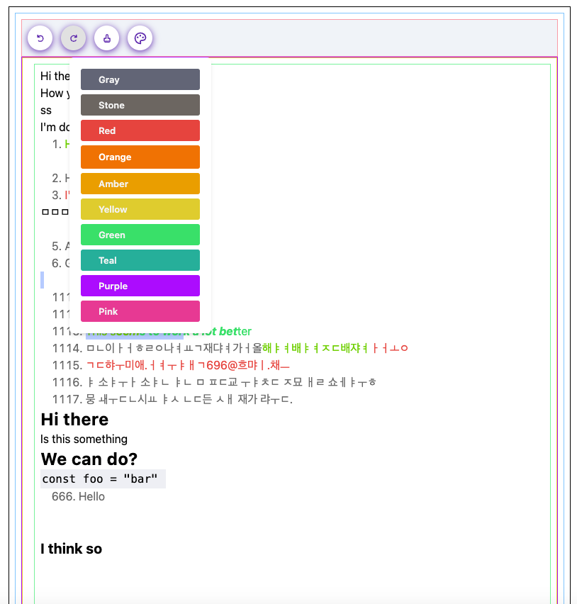
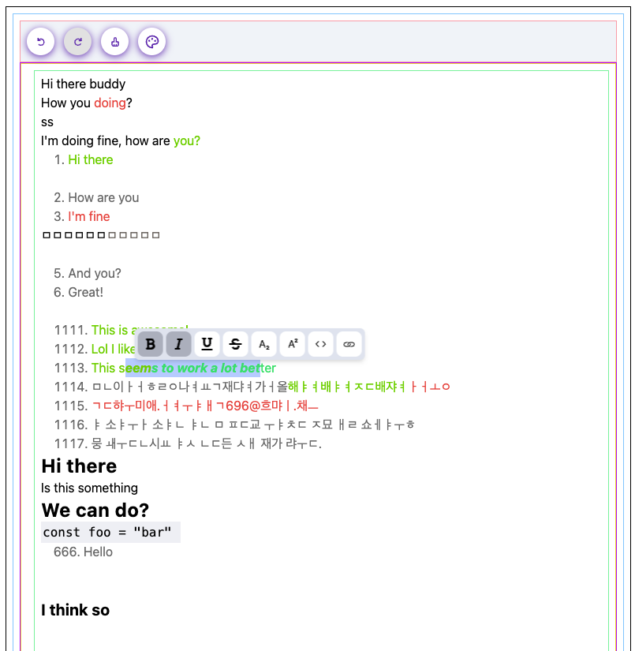

## Apr 24 / 20 23

Another day another update on the development of LexiFlow.
Let's get flowing with lexical!

I spent the entire weekend digging into lexical source code to try and
understand how the inner pieces work, what API's can I use to modify
the document and what are some conventions that the core team uses
while developing new plugins and nodes.

The first thing I noticed is that many of the APIs used internally are not
yet being exported in the final library like the `createEmptyEditorState` method
which is used internally in multiple places, but it's not exported from lexical (expect for its type).

I had to re-implement my own version of this method and I'm not sure if
this is the best way to go,

but I created this method, it optionally takes in an editor instance
to use the same configuration for the new state and returns an empty state,
I had to call `createEditor` method to get a new editor with empty state, then I clone the state
and return it.

The final method looks like this:

```ts
import { createEditor, EditorState, LexicalEditor } from "lexical";

export const createEmptyEditorState = (editor?: LexicalEditor): EditorState => {
  return createEditor(editor?._config).getEditorState().clone();
};
```

### New Plugins!

Okay I actually managed to create three new plugins, two of tem
exist in lexical original playground.

1. Toolbar Plugin
2. Floating Toolbar Plugin
3. Color Picker Plugin

Let's take a look at some images.

Color Picker


Floating Toolbar


And we can also see the toolbar at the top,
right now it only has undo/redo buttons, clear formatting button
and the color picker.

The current implementation of these plugins uses tailwind and a
pre-defined markup that styles it accordingly, in the future I want
to provide base plugins without interface so the developer can define
it's own markup and style with tailwind or standard css, right now
this is not worth it because I'm just exploring the framework.

### Final Considerations

- So far Lexical has proven to be a really flexible and extensible framework
- I have tested the IME support for asian languages (like Korean) and it works a lot better than other alternatives,
  I'm really impressed by how the team behind meta were able to normalize such a chaotic API.
- Mobile support looks good, no bugs so far except for the translation flag showing up on top of the selection and
  overflowing the floating toolbar, maybe we'll have to use a fixed toolbar for mobile, it should probably be sticky to
  the top too.
- The FloatingToolbar has a bug, if you select some text the toolbar will show up,
  if you click the color picker in the top toolbar the Floating toolbar continues open,
  it should close automatically if the editor loses focus, in this case the focus is being moved to the
  colors dropdown.
- It's really difficult to find good icons for text editors (like align text, change color, clear formatting and so
  on..)
  can someone please create a library for this already? (right now we are using react-icons and radix-icons, radix-icons
  is actually included in the react-icons package so maybe we can remove that)
- TipTap provides a great abstration for prosemirror, can we reach the same level of
Developer experience? I hope so, obviously I'm just a single dev and even if I were very good it would still take time,
let's be patient and hope for the best.
