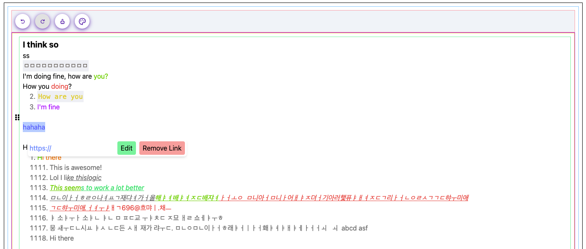

## Apr 27 / 20 23

New day, new update. Since the last update I have updated the editor to include two new plugins:
- Draggable blocks plugin (Yaaay!)
- Edit Link dialog plugin (Yaaay!)

These two were not that difficult because I already had the logic to position the elements based
on a virtual rect.

The draggable blocks plugin is a plugin that allows you to **drag blocks** around the editor. It is
inspired by the behavior in notion and other block editors, this one is extremely flexible and
should work with any block type at the **top-level** of the **node tree**.

I actually struggled a little bit to understand the calculation for positioning the drag handle,
but it's fine now. I also had to add a new method to the editor to get the position of a block
based on it's key.

For the Edit link dialog it was pretty easy, I added some command listeners and selection listeners
that show a small popup below the text to edit the link. It's pretty cool.

Here is an image showcasing the current state of the plugins, don't judge my styling I'm building the 
most difficult parts first and then I'll come back later to create some proper styled examples.

## Next Steps

For the next steps I want to add one last plugin to the editor before I come back and make some proper
refactoring and useful examples with styling.

I'm talking about the **"Slash menu"** also known as Suggester popup. This is the popup that shows up when
you type "/" in notion and it allows you to insert blocks, emojis, etc.

It is known as **suggester popup** for me because we have a similar concept in prosemirror where
based on a given key or text trigger a popup would show up at the cursor position and the user
could select an option from the popup.

This is a very versatile plugin that can be used in a variety of cases and situations and I believe
by having it I can plan the actual next steps more carefully and with more confidence.

I'm also thinking about adding a "Block Menu" plugin that would allow you to insert blocks from a
menu, but I'm not sure if I should do that or just use the suggester popup for that.

I guess it depends on the requirements or personal choice of whoever is developing the editor.

### Final Considerations

Anyway that's it for today, I don't know if someone is reading this, but I hope you are enjoying
This editor is coming along pretty quickly and I'm happy with the current results, 

As I get more familiar with the framework it will be easier to expose primitive components and apis for users
to build their own plugins and extensions based on these primitives.

That's it for today, see you on the next one!
